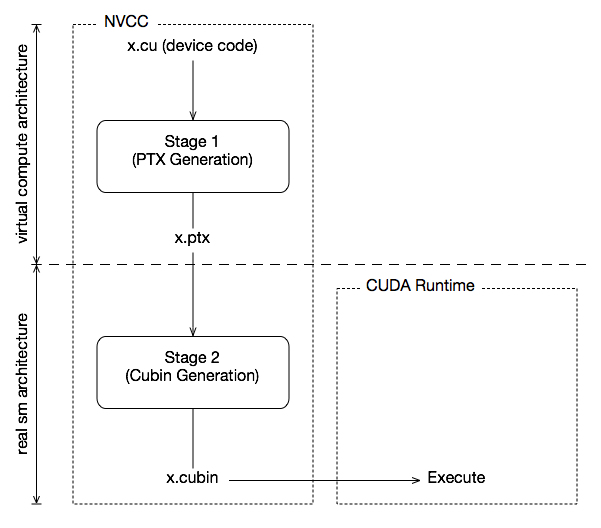

# What are the fundamental components with respect to CUDA compilation flow?

Understanding PTX and SASS is crucial for HPC engineers because PTX ensures forward compatibility with future GPUs, while SASS provides architecture-specific optimizations for peak performance on current hardware. This knowledge allows engineers to write efficient, portable code that can run across different generations of NVIDIA GPUs.

## Some pre-requisites:

### `compute_XY` vs `sm_XY`

Let's discuss them w.r.t an example compute capability 8.6 (i.e. `compute_86`, `sm_86`). The architecture specified here is typically referred to as `compute_XY` or `sm_XY`, where `XY` corresponds to the compute capability of the GPU. Even if you don't fully understand them now, I assure you, you will understand everything when you finish this article.

- **What are actually `compute_XY` & `sm_XY`?** [4.2.7. Options for Steering GPU Code Generation](https://docs.nvidia.com/cuda/archive/11.4.0/cuda-compiler-driver-nvcc/index.html#options-for-steering-gpu-code-generation) doc says, There are 2 types of architecture, such as `real` architecture and `virtual` architecture. `nvcc` embeds a compiled code image in the resulting executable for each specified code architecture. I.e. `nvcc` generates & embeds `SASS` (binary code) for real architecture (i.e. `sm_XY`) and `PTX` (intermediate code) for `virtual` architectures (i.e. `compute_XY`). For more: [CUDA Virtual & Real Architectures](https://docs.nvidia.com/cuda/archive/11.4.0/cuda-compiler-driver-nvcc/index.html#virtual-architectures)




- **`compute_86`**: You are telling the compiler to generate `PTX` (Parallel Thread Execution) code.
- **`sm_86`**: But for `sm_86`, you are telling the compiler **to generate binary code (cubin)** that is optimized and **directly executable on GPUs with the specific architecture corresponding to compute capability 8.6.**

- **`compute_86` Usage**: `PTX` code generated with `compute_86`, can be JIT-compiled (Just-In-Time compiled) by the CUDA driver into the actual machine code. That machine code can run on any GPU with compute capability 8.6. This provides forward compatibility with future GPUs that share this compute capability but might have new optimizations or features that aren't present in the current hardware.
- **`sm_86` Usage**: `sm_86` ensures that the code is fully optimized for the specific GPU architecture, taking advantage of all the features and performance characteristics of that architecture. **However, this binary is not forward-compatible with future architectures unless those architectures maintain backward compatibility with `sm_86`.**


## Typical code compilation flow: src -[Stackoverflow thread](https://stackoverflow.com/a/17599585)

You can have a look on Nvidia official doc [options-for-steering-gpu-code-generation](https://docs.nvidia.com/cuda/cuda-compiler-driver-nvcc/index.html#options-for-steering-gpu-code-generation) for understanding different compilation flags.

Let's have a look on a typical CUDA source code to binary compilation flow.

```sh
CUDA C/C++ device code source --> PTX (Intermediate Representation, in assembly) --> SASS (Machine Code, object files) --> Binary (Executable)
```

Let's discuss them in details.


### PTX (Parallel Thread Execution):

- When the CUDA code is compiled, the device code is first compiled into `PTX`, which is architecture-agnostic. `PTX` allows flexibility and forward compatibility with newer GPU architectures.

- By default, `PTX` is included in the binary for a default arch based on your CUDA version installation.

- You have to specify the `-arch=compute_XY` (i.e. short form of flag `--gpu-architecture=compute_XY`) for emitting `PTX` code from given `*.cu` cuda code file.

```sh
# Command: With no arch supplied
nvcc -ptx my_cuda_code.cu -o my_cuda_code.ptx

# Command: GPU architecture specific format
nvcc -arch=compute_XY -ptx my_cuda_code.cu -o my_kernel_XY.ptx

# Command: for Ampere compute_86
nvcc -arch=compute_86 -ptx my_cuda_code.cu -o my_kernel_86.ptx
# Or,
nvcc --gpu-architecture=compute_86 -ptx my_cuda_code.cu -o my_kernel_86.ptx


# Command: Check file content
cat my_kernel_86.ptx
# Returns
//
// Generated by NVIDIA NVVM Compiler
//
// Compiler Build ID: CL-30521435
// Cuda compilation tools, release 11.4, V11.4.152
// Based on NVVM 7.0.1
//

.version 7.4
.target sm_86
.address_size 64

	// .globl	_Z11add_vectorsPdS_S_

.visible .entry _Z11add_vectorsPdS_S_(
	.param .u64 _Z11add_vectorsPdS_S__param_0,
	.param .u64 _Z11add_vectorsPdS_S__param_1,
	.param .u64 _Z11add_vectorsPdS_S__param_2
)
{
	.reg .pred 	%p<2>;
	.reg .b32 	%r<5>;
	.reg .f64 	%fd<4>;
	.reg .b64 	%rd<11>;


	ld.param.u64 	%rd1, [_Z11add_vectorsPdS_S__param_0];
	ld.param.u64 	%rd2, [_Z11add_vectorsPdS_S__param_1];
	ld.param.u64 	%rd3, [_Z11add_vectorsPdS_S__param_2];
	mov.u32 	%r2, %ntid.x;
	mov.u32 	%r3, %ctaid.x;
	mov.u32 	%r4, %tid.x;
	mad.lo.s32 	%r1, %r2, %r3, %r4;
	setp.gt.s32 	%p1, %r1, 1048575;
	@%p1 bra 	$L__BB0_2;

	cvta.to.global.u64 	%rd4, %rd1;
	mul.wide.s32 	%rd5, %r1, 8;
	add.s64 	%rd6, %rd4, %rd5;
	cvta.to.global.u64 	%rd7, %rd2;
	add.s64 	%rd8, %rd7, %rd5;
	ld.global.f64 	%fd1, [%rd8];
	ld.global.f64 	%fd2, [%rd6];
	add.f64 	%fd3, %fd2, %fd1;
	cvta.to.global.u64 	%rd9, %rd3;
	add.s64 	%rd10, %rd9, %rd5;
	st.global.f64 	[%rd10], %fd3;

$L__BB0_2:
	ret;

}
```


### SASS (Streaming Assembler):

- `PTX` is then further compiled into `SASS`, which is the actual architecture-specific machine code (also can be found as `object file` or `*.o`).

- `SASS` is tied to a specific GPU architecture (e.g., `Pascal`, `Volta`, `Turing`, `Ampere`, etc.).

- **`-arch=compute_XY|sm_XY` flag is used to embed `SASS` also. For reminder, `-arch=compute_XY|sm_XY` flag is the short form of `--gpu-architecture=compute_XY|sm_XY`. For simplicity, I have used `-arch=compute_XY|sm_XY` flag format through out the rest of the examples.**

- **If no specific architecture is provided by using `-arch=compute_XY|sm_XY` flag, then `PTX` & `SASS` both are generated for a default architecture (for CUDA `11.4` version, the default `sm_52` arch is loaded).**

```sh
# Command: No "-arch=compute_XY|sm_XY" is passed (CUDA-11.4 version used)
nvcc -c my_cuda_code.cu -o my_cuda_object_code.o

# Command: Check if the default "PTX" is loaded
cuobjdump -ptx my_cuda_object_code.o
# Returns
Fatbin elf code:
================
arch = sm_52
code version = [1,7]
producer = <unknown>
host = linux
compile_size = 64bit

Fatbin ptx code:
================
arch = sm_52
code version = [7,4]
producer = <unknown>
host = linux
compile_size = 64bit
compressed

.version 7.4
.target sm_52
.address_size 64

.visible .entry _Z11add_vectorsPdS_S_(
.param .u64 _Z11add_vectorsPdS_S__param_0,
.param .u64 _Z11add_vectorsPdS_S__param_1,
.param .u64 _Z11add_vectorsPdS_S__param_2
)
{
...
....
$L__BB0_2:
ret;
}


# Command: Check if the default "SASS" is loaded
cuobjdump -sass my_cuda_object_code.o
# Returns
Fatbin elf code:
================
arch = sm_52
code version = [1,7]
producer = <unknown>
host = linux
compile_size = 64bit

	code for sm_52
		Function : _Z11add_vectorsPdS_S_
	.headerflags    @"EF_CUDA_SM52 EF_CUDA_PTX_SM(EF_CUDA_SM52)"
                                                                         /* 0x001cfc00e22007f6 */
        /*0008*/           MOV R1, c[0x0][0x20] ;                        /* 0x4c98078000870001 */
        /*0010*/           S2R R0, SR_CTAID.X ;                          /* 0xf0c8000002570000 */
        /*0018*/           S2R R2, SR_TID.X ;                            /* 0xf0c8000002170002 */
                                                                         /* 0x001fd842fec20ff1 */
        /*0028*/           XMAD.MRG R3, R0.reuse, c[0x0] [0x8].H1, RZ ;  /* 0x4f107f8000270003 */
        /*0030*/           XMAD R2, R0.reuse, c[0x0] [0x8], R2 ;         /* 0x4e00010000270002 */
        /*0038*/           XMAD.PSL.CBCC R0, R0.H1, R3.H1, R2 ;          /* 0x5b30011800370000 */
                                                                         /* 0x001ff400fd4007ed */
        /*0048*/           ISETP.GT.AND P0, PT, R0, c[0x2][0x0], PT ;    /* 0x4b69038800070007 */
        /*0050*/           NOP ;                                         /* 0x50b0000000070f00 */
        /*0058*/       @P0 EXIT ;                                        /* 0xe30000000000000f */
                                                                         /* 0x081fd800fea207f1 */
        /*0068*/           SHL R8, R0.reuse, 0x3 ;                       /* 0x3848000000370008 */
        /*0070*/           SHR R0, R0, 0x1d ;                            /* 0x3829000001d70000 */
        /*0078*/           IADD R4.CC, R8.reuse, c[0x0][0x140] ;         /* 0x4c10800005070804 */
                                                                         /* 0x001fd800fe0207f2 */
        /*0088*/           IADD.X R5, R0.reuse, c[0x0][0x144] ;          /* 0x4c10080005170005 */
        /*0090*/ {         IADD R6.CC, R8, c[0x0][0x148] ;               /* 0x4c10800005270806 */
        /*0098*/           LDG.E.64 R4, [R4]         }
                                                                         /* 0xeed5200000070404 */
                                                                         /* 0x001fd800f62007e2 */
        /*00a8*/           IADD.X R7, R0, c[0x0][0x14c] ;                /* 0x4c10080005370007 */
        /*00b0*/           LDG.E.64 R2, [R6] ;                           /* 0xeed5200000070602 */
        /*00b8*/           IADD R8.CC, R8, c[0x0][0x150] ;               /* 0x4c10800005470808 */
                                                                         /* 0x003fc420e28007f7 */
        /*00c8*/           IADD.X R9, R0, c[0x0][0x154] ;                /* 0x4c10080005570009 */
        /*00d0*/           DADD R2, R2, R4 ;                             /* 0x5c70000000470202 */
        /*00d8*/           STG.E.64 [R8], R2 ;                           /* 0xeedd200000070802 */
                                                                         /* 0x001ffc00ffe007e8 */
        /*00e8*/           NOP ;                                         /* 0x50b0000000070f00 */
        /*00f0*/           EXIT ;                                        /* 0xe30000000007000f */
        /*00f8*/           BRA 0xf8 ;                                    /* 0xe2400fffff87000f */
		..........


Fatbin ptx code:
================
arch = sm_52
code version = [7,4]
producer = <unknown>
host = linux
compile_size = 64bit
compressed
```

- `-arch=compute_XY|sm_XY` flag is used to embed the architecture target specific `PTX` and/or `SASS` code into the `*.o` object files. Here the confusing part is, `-code=sm_XY` flag should only deal the embedment of `SASS` code into `*.o` files. But you can only use the `-arch=compute_XY|sm_XY` for generating `*.o` object file. `nvcc` doesn't accept `-code=sm_XY` alone for such cases. Means `code=sm_XY` flag only works if you pass it along with `-arch=` like `-gencode arch=compute_XY,code=sm_XY`.

```sh
# Command: for generating target specific object file with "PTX" + "SASS"
nvcc -arch=compute_86 -code=sm_86 -c my_cuda_code.cu -o my_cuda_object_code.o

# Command: for generating target specific cubin file with "PTX" + "SASS"
nvcc -arch=compute_86 -code=sm_86 -c my_cuda_code.cu -o my_cuda_cubin

# Or, Command: (Later I will explain this)
nvcc -gencode arch=compute_86,code=sm_86 -c my_cuda_code.cu -o my_cuda_cubin
```

- **If you only pass `-arch=compute_XY`, then it will only embed the `PTX` code into the `*.o` file. You will not find the `SASS` code in that `*.o` file. Now let's think of a case. You generated `*.o` for a specific `-arch=compute_86`, means only `PTX` is embedded in this object file. But if you use this `*.o` file to compile a cubin, and you run that cubin in other arch GPU device (e.g. `sm_75`); then in program bin runtime, CUDA driver will JIT-compile the `compute_86` arch specific `PTX` code to `sm_75` arch specific `SASS` code; and then execute in that GPU device.**


```sh
# Command: Only embed the "PTX" into object file
nvcc -arch=compute_86 -c my_cuda_code.cu -o my_cuda_object_code.o


# Command: Check if the "PTX" is embedded in the object file
cuobjdump -ptx my_cuda_object_code.o
# Returns (PTX exists)
Fatbin ptx code:
================
arch = sm_86
code version = [7,4]
producer = <unknown>
host = linux
compile_size = 64bit
compressed

.version 7.4
.target sm_86
.address_size 64

.visible .entry _Z11add_vectorsPdS_S_(
.param .u64 _Z11add_vectorsPdS_S__param_0,
.param .u64 _Z11add_vectorsPdS_S__param_1,
.param .u64 _Z11add_vectorsPdS_S__param_2
)
{
.....
....
..

cvta.to.global.u64 %rd9, %rd3;
add.s64 %rd10, %rd9, %rd5;
st.global.f64 [%rd10], %fd3;

$L__BB0_2:
ret;
}


# Command: Check if the "SASS" is embedded in the object file
cuobjdump -sass my_cuda_object_code.o
# Returns (SASS doesn't exist)
Fatbin ptx code:
================
arch = sm_86
code version = [7,4]
producer = <unknown>
host = linux
compile_size = 64bit
compressed

# <EMPTY>
```

- **If you only pass `-arch=sm_XY`, then first it will embed the `PTX` code into the `*.o` file. Then it will generate the `SASS` code from that `PTX` code and embed that into `*.o` file. So `-arch=sm_XY` is taking care of the generation of `PTX` + `SASS` sequentially.**

```sh
# Command: Embed the "PTX" + "SASS" into object file
nvcc -arch=sm_86 -c my_cuda_code.cu -o my_cuda_object_code.o

# Command: Check if the "PTX" is embedded in the object file
cuobjdump -ptx my_cuda_object_code.o
# Returns (PTX exists compute_86)
Fatbin elf code:
================
arch = sm_86
code version = [1,7]
producer = <unknown>
host = linux
compile_size = 64bit

Fatbin ptx code:
================
arch = sm_86
code version = [7,4]
producer = <unknown>
host = linux
compile_size = 64bit
compressed

.version 7.4
.target sm_86
.address_size 64

.visible .entry _Z11add_vectorsPdS_S_(
.param .u64 _Z11add_vectorsPdS_S__param_0,
.param .u64 _Z11add_vectorsPdS_S__param_1,
.param .u64 _Z11add_vectorsPdS_S__param_2
)
{
....
...
..
$L__BB0_2:
ret;
}


# Command: Check if the "SASS" is embedded in the object file
cuobjdump -sass my_cuda_object_code.o
# Returns (SASS exists for sm_86)
Fatbin elf code:
================
arch = sm_86
code version = [1,7]
producer = <unknown>
host = linux
compile_size = 64bit

	code for sm_86
		Function : _Z11add_vectorsPdS_S_
	.headerflags    @"EF_CUDA_SM86 EF_CUDA_PTX_SM(EF_CUDA_SM86)"
        /*0000*/                   MOV R1, c[0x0][0x28] ;                             /* 0x00000a0000017a02 */
                                                                                      /* 0x000fc40000000f00 */
        /*0010*/                   S2R R8, SR_CTAID.X ;                               /* 0x0000000000087919 */
                                                                                      /* 0x000e280000002500 */
		.........

Fatbin ptx code:
================
arch = sm_86
code version = [7,4]
producer = <unknown>
host = linux
compile_size = 64bit
compressed
```


- **Why you cannot directly use `-code=sm_XY` for generating `SASS` embedded `*.o` object/machine code? Instead, why you have to use `-arch=sm_XY` flag? `-arch=sm_XY` is a shorthand for `--gpu-architecture=sm_XY` flag, that implicitly tells `nvcc` to generate both `PTX` and `SASS` for the specified architecture. This ensures both `PTX` and SASS are generated in a single step, making it simpler to compile for a specific architecture.**

```sh
# Command: If "-arch=compute_86" supplied, then only "PTX" code will be embedded. That's why you will nothing returned in the terminal. Because to embed the "SASS", you need to pass "-arch=sm_86"
nvcc -arch=compute_86 -c my_cuda_code.cu -Xptxas -v -o my_cuda_object_code.o


# Command: If no "-arch=sm_XY" supplied, "SASS" is generated for default -code "sm_52"
nvcc -c my_cuda_code.cu -Xptxas -v -o my_cuda_object_code.o
# Returns
ptxas info    : 0 bytes gmem
ptxas info    : Compiling entry function '_Z11add_vectorsPdS_S_' for 'sm_52'
ptxas info    : Function properties for _Z11add_vectorsPdS_S_
    0 bytes stack frame, 0 bytes spill stores, 0 bytes spill loads
ptxas info    : Used 10 registers, 344 bytes cmem[0], 4 bytes cmem[2] # <== For no arch supplied, the register count is 10.


# Command: If "-arch=sm_XY" supplied, "PTX" + "SASS" both will be embedded into the "*.o".
nvcc -arch=sm_86 -c my_cuda_code.cu -Xptxas -v -o my_cuda_object_code.o
# Returns
ptxas info    : 0 bytes gmem
ptxas info    : Compiling entry function '_Z11add_vectorsPdS_S_' for 'sm_86'
ptxas info    : Function properties for _Z11add_vectorsPdS_S_
    0 bytes stack frame, 0 bytes spill stores, 0 bytes spill loads
ptxas info    : Used 12 registers, 376 bytes cmem[0] # <== For specified arch, the register count is different from the default "sm_52"


# Then if you want to inspect the generated SASS code directly, it will dump the SASS code in terminal
cuobjdump -sass my_cuda_object_code.o
```


### Binary (Executable):

- The final binary includes both the CPU (host) and GPU (device) code. **The `PTX` + `SASS`(GPU code) both are included in this binary**, which can be executed on the GPU hardware.

```sh
# Command: For default `PTX` + `SASS` included bin
nvcc my_cuda_code.cu -o my_cuda_cubin
```

- `--generate-code` flag's short form is `-gencode`.

- **Note: If you donot specify `-gencode arch=compute_XY,code=sm_XY` while generating the bin, then the `PTX` & `SASS` will be loaded in the bin for a default architecture. For `CUDA 11.4` version, I found the default is `sm_52`**


- You can load `PTX` + `SASS` for a particular GPU architecture using the flag `-gencode arch=compute_XY,code=sm_XY`

```sh
# Command: For a targeted architecture
nvcc -gencode arch=compute_86,code=sm_86 my_cuda_code.cu -o my_cuda_cubin
```

- You can load `PTX` + `SASS` for multiple GPU architectures also. This will ensure the binary is compatible for your specified architectures. You can add `-gencode arch=compute_XY,code=sm_XY -gencode arch=compute_XY,code=sm_XY ...` as you want. The purpose of multiple `-arch` flags is to use the `__CUDA_ARCH__` macro for conditional compilation (i.e., using `#ifdef`) of differently-optimized code paths. Check [5.7.4. Virtual Architecture Identification Macro](https://docs.nvidia.com/cuda/archive/11.4.0/cuda-compiler-driver-nvcc/index.html#virtual-architecture-identification-macro) for more.

```sh
# Command: For targeting multiple GPU architectures
nvcc -gencode arch=compute_86,code=sm_86 -gencode arch=compute_75,code=sm_75 my_cuda_code.cu -o my_cuda_cubin
```


# 1. Difference between `nvcc` compile flags `--gpu-architecture` vs `--gpu-code` vs `--generate-code`

## Pre-requisite: How generic CUDA compilation works targeting an architecture?


## `--gpu-architecture`

`nvcc --help` says

```sh
--gpu-architecture <arch> (-arch)                         
        Specify the name of the class of NVIDIA 'virtual' GPU architecture for which the CUDA input files must be compiled. With the exception as described for the shorthand below, the architecture specified with this option must be a 'virtual' architecture (such as compute_50).
        
        Normally, this option alone does not trigger assembly of the generated PTX for a 'real' architecture (that is the role of nvcc option '--gpu-code', see below); rather, its purpose is to control preprocessing and compilation of the input to PTX. For convenience, in case of simple nvcc compilations, the following shorthand is supported.  If no value for option '--gpu-code' is specified, then the
        value of this option defaults to the value of '--gpu-architecture'.  In this situation, as only exception to the description above, the value specified for '--gpu-architecture' may be a 'real' architecture (such as a sm_50), in which case nvcc uses the specified 'real' architecture and its closest 'virtual' architecture as effective architecture values.
        
        For example, 'nvcc --gpu-architecture=sm_50' is equivalent to 'nvcc --gpu-architecture=compute_50 --gpu-code=sm_50,compute_50'.
        
        Note: the values compute_30, compute_32, compute_35, compute_37, compute_50, sm_30, sm_32, sm_35, sm_37 and sm_50 are deprecated and may be removed in a future release.
        
        Allowed values for this option:  'compute_35','compute_37','compute_50',
        'compute_52','compute_53','compute_60','compute_61','compute_62','compute_70',
        'compute_72','compute_75','compute_80','compute_86','compute_87','lto_35',
        'lto_37','lto_50','lto_52','lto_53','lto_60','lto_61','lto_62','lto_70',
        'lto_72','lto_75','lto_80','lto_86','lto_87','sm_35','sm_37','sm_50','sm_52',
        'sm_53','sm_60','sm_61','sm_62','sm_70','sm_72','sm_75','sm_80','sm_86',
        'sm_87'.
```
- **Purpose**: It's purpose is to control preprocessing and compilation of the input CUDA code to PTX code.
- **Idea**: This option sets the target architecture for which the `PTX` (Parallel Thread Execution) **intermediate representation** code and `SASS` code are generated. At first stage of the CUDA compilation process, your code is converted into an `PTX` **intermediate representation** code. In next stage, this `PTX` will be compiled to a `SASS` code targeting a particular GPU hardware (i.e. `SASS` is embedded into `*.o` object file and in cubin). `compute_XY` refers the architecture for the `PTX` code. And the targeted `SASS` code could be referred to `sm_XY`. Here `XY` corresponds to the compute capability of the GPU. For instance, `compute_86` & `sm_86` corresponds to `PTX` & `SASS` code targeting **compute capability `8.6` Ampere architecture** GPUs.
- **Case study**: Let's think of a case on Ampere arch with compute capability `8.6`. For `--gpu-architecture=compute_86` flag, only `PTX` code will be embedded into your machine code object file or to cubin. But the `SASS` will be **JIT compiled** on-the-fly (i.e. in runtime) when you run that cubin on a real GPU device. But If you only pass `--gpu-architecture=sm_86`, then it will first generate & embed the `PTX` for same `compute_86`, and finally from that `PTX`, it will generate & embed the `SASS` code for `sm_86` into the machine code or to cubin.
- **Syntax**: `--gpu-architecture=compute_XY|sm_XY`, or in-short `-arch=compute_XY|sm_XY`
- **Example**: `--gpu-architecture=compute_86|sm_86`, or in-short `-arch=compute_86|sm_86`

```sh
# Command: To generate an object file w/ architecture specific PTX. In such case, "SASS" will generate in cuda runtime
nvcc --gpu-architecture=compute_86 -c my_cuda_code.cu -o my_cuda_object_code.o
# Or,
nvcc -arch=compute_86 -c my_cuda_code.cu -o my_cuda_object_code.o


# Command: To generate an object file w/ architecture specific PTX + SASS
nvcc --gpu-architecture=sm_86 -c my_cuda_code.cu -o my_cuda_object_code.o
# Or,
nvcc -arch=sm_86 -c my_cuda_code.cu -o my_cuda_object_code.o


# Command: To generate a cubin file w/ architecture specific PTX. In such case, "SASS" will generate in cuda runtime
nvcc --gpu-architecture=compute_86 -c my_cuda_code.cu -o my_cuda_cubin
# Or,
nvcc -arch=compute_86 -c my_cuda_code.cu -o my_cuda_cubin


# Command: To generate a cubin file w/ architecture specific PTX + SASS
nvcc --gpu-architecture=sm_86 -c my_cuda_code.cu -o my_cuda_cubin
# Or,
nvcc -arch=sm_86 -c my_cuda_code.cu -o my_cuda_cubin
```


## `--gpu-code`

`nvcc --help` says

```sh
--gpu-code <code>,...                           (-code)                         
        Specify the name of the NVIDIA GPU to assemble and optimize PTX for. nvcc embeds a compiled code image in the resulting executable for each specified <code> architecture, which is a true binary load image for each 'real' architecture (such as sm_50), and PTX code for the 'virtual' architecture (such as compute_50).  During runtime, such embedded PTX code is dynamically compiled by the CUDA runtime system if no binary load image is found for the 'current' GPU. Architectures specified for options '--gpu-architecture' and '--gpu-code'  may be 'virtual' as well as 'real', but the <code> architectures must be compatible with the <arch> architecture.  When the '--gpu-code' option is used, the value for the '--gpu-architecture' option must be a 'virtual' PTX architecture.

        For instance, '--gpu-architecture=compute_60' is not compatible with '--gpu-code=sm_52', because the earlier compilation stages will assume the availability of 'compute_60' features that are not present on 'sm_52'.
        Note: the values compute_30, compute_32, compute_35, compute_37, compute_50, sm_30, sm_32, sm_35, sm_37 and sm_50 are deprecated and may be removed in a future release.

        Allowed values for this option:  'compute_35','compute_37','compute_50',
        'compute_52','compute_53','compute_60','compute_61','compute_62','compute_70',
        'compute_72','compute_75','compute_80','compute_86','compute_87','lto_35',
        'lto_37','lto_50','lto_52','lto_53','lto_60','lto_61','lto_62','lto_70',
        'lto_72','lto_75','lto_80','lto_86','lto_87','sm_35','sm_37','sm_50','sm_52',
        'sm_53','sm_60','sm_61','sm_62','sm_70','sm_72','sm_75','sm_80','sm_86',
        'sm_87'.
```
- **Purpose**: Specifies the target GPU architecture(s) for which `SASS` code are embedded into machine code (i.e. object file) or in cubin.
- **Idea**: This flag tells the compiler to generate and embed `SASS` code for targeted architecture(s). But you cannot use this flag alone. You have to use this flag in conjunction with `--gpu-architecture=compute_XY --gpu-code=sm_XY`
- **Syntax**: `--gpu-code=sm_XY`, or in-short `-code=sm_XY`. But the usable flag combination is `--gpu-architecture=compute_XY --gpu-code=sm_XY`
- **Example**: `--gpu-code=sm_86`, or in-short `-code=sm_86`. Usable flag combination is `--gpu-architecture=compute_86 --gpu-code=sm_86`

```sh
# Command: To generate an architecture specific object file
nvcc --gpu-architecture=compute_86 --gpu-code=sm_86 -c my_cuda_code.cu -o my_cuda_object_code.o
# Or,
nvcc -arch=compute_86 -code=sm_86 -c my_cuda_code.cu -o my_cuda_object_code.o


# Command: To generate an architecture specific cubin file
nvcc --gpu-architecture=compute_86 --gpu-code=sm_86 -c my_cuda_code.cu -o my_cuda_cubin
# Or,
nvcc -arch=compute_86 -code=sm_86 -c my_cuda_code.cu -o my_cuda_cubin


# Command: If you only use "--gpu-code=sm_86" or "--gpu-code=compute_86"
nvcc --gpu-code=sm_86 -c my_cuda_code.cu -o my_cuda_object_code.o
# Or,
nvcc --gpu-code=compute_86 -c my_cuda_code.cu -o my_cuda_object_code.o
# Returns error
nvcc fatal   : -arch option not specified
```


## `--generate-code`

`nvcc --help` says

```sh
--generate-code <specification>,...             (-gencode)
        
        This option provides a generalization of the '--gpu-architecture=<arch> --gpu-code=<code>, ...' option combination for specifying nvcc behavior with respect to code generation.  Where use of the previous options generates code for different 'real' architectures with the PTX for the same 'virtual' architecture, option '--generate-code' allows multiple PTX generations for different 'virtual' architectures. In fact, '--gpu-architecture=<arch> --gpu-code=<code>, ...' is equivalent to '--generate-code arch=<arch>,code=<code>,...'.

        '--generate-code' options may be repeated for different virtual architectures.
        Allowed keywords for this option:  'arch','code'.
```
- **Purpose**: Combines `--gpu-architecture` and `--gpu-code` into a single option to provide a flexible way to specify both the architecture and the target code generation.
- **Idea**: This option is the most versatile as **it allows specifying both the architecture for PTX generation and the code for final machine code or PTX retention.** It’s equivalent to using `--gpu-architecture` and `--gpu-code` together but provides more control over the generation process. You can use it multiple times on the command line to generate different binaries for different architectures in a single compilation process.
- **Syntax**: `--generate-code arch=compute_XY,code=sm_XY`, or in-short `-gencode arch=compute_XY,code=sm_XY`
- **Example**: `--generate-code arch=compute_86,code=sm_86`, or in-short `-gencode arch=compute_86,code=sm_86`

```sh
# Command: For one arch specific cubin
nvcc --generate-code arch=compute_86,code=sm_86 -c my_cuda_code.cu -o my_cuda_cubin
# Or,
nvcc -gencode arch=compute_86,code=sm_86 -c my_cuda_code.cu -o my_cuda_cubin


# Command: For multiple arch targeted cubin
nvcc --generate-code arch=compute_86,code=sm_86 --generate-code arch=compute_75,code=sm_75 -c my_cuda_code.cu -o my_cuda_cubin
# Or,
nvcc -gencode arch=compute_86,code=sm_86 -gencode arch=compute_75,code=sm_75 -c my_cuda_code.cu -o my_cuda_cubin
```